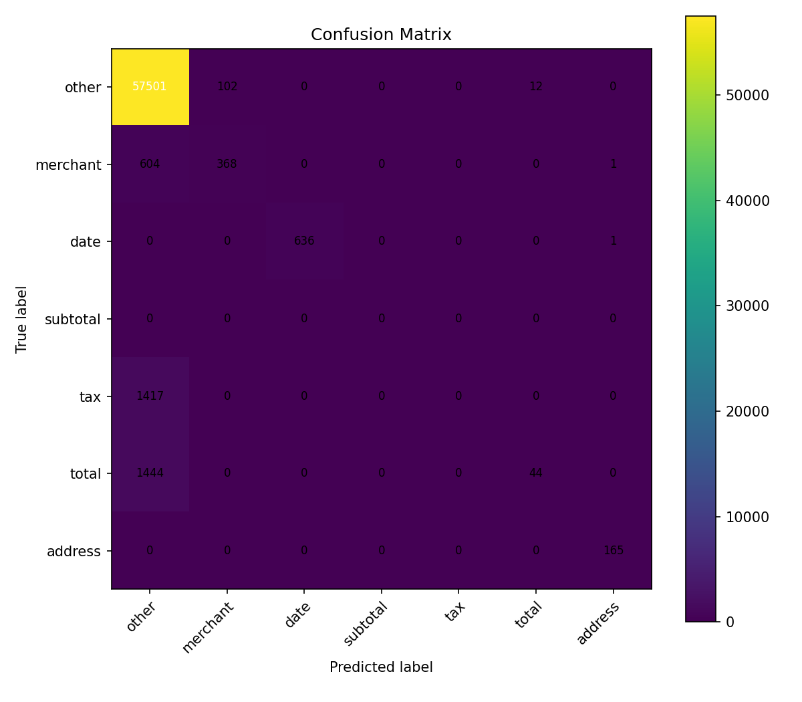

ReceiptRadar — Receipt OCR, Line-Item Parsing & Expense Fraud Scoring

Automate receipt understanding end-to-end:

Detect & read text (OCR),

Parse key fields & line items (merchant/date/subtotal/tax/total + item rows),

Score anomalies/fraud (arithmetic/policy/dup checks),

Serve a tiny API + web demo.

If your confusion matrix image lives somewhere else (e.g., C:\Users\sagni\Downloads\ReceiptRadar\confusion_matrix.png), either copy it to the repo root or change the link above to the correct relative path (e.g., artifacts/confusion_matrix.png).

✨ Features

Strong OCR via docTR / EasyOCR / Tesseract with graceful fallbacks.

Compact Keras parser model (BiLSTM/MLP-style token tagger) for key-value & line-items.

Fraud scoring: arithmetic checks, duplicate detection via pHash, simple policy heuristics.

FastAPI service + minimal HTML upload UI.

Saves portable artifacts: .keras, .h5, .pkl, .yaml, .json, and plots.

📦 Project Layout (suggested)
ReceiptRadar/
  app.py
  infer.py
  requirements.txt
  README.md
  uploads/           # runtime uploads (auto-created)
  overlays/          # runtime overlays (auto-created)
  artifacts/         # phash index, vocab, etc.
  parser_model.h5
  parser_model.keras
  preprocessor.pkl
  ocr_model_config.yaml
  metrics.json
  loss_curve.png
  confusion_matrix.png
  pr_curve_fraud.png
  calibration.png

Your training data (e.g., SROIE / CORD) can live outside the repo, e.g.
C:\Users\sagni\Downloads\ReceiptRadar\archive\findit2.

🛠️ Setup
# (Recommended) Create/activate a virtualenv, then:
pip install -r requirements.txt

Windows OCR notes

Tesseract: Install from the official Windows installer, then ensure the executable is at
C:\Program Files\Tesseract-OCR\tesseract.exe (our code auto-detects this path).

PDFs: For pdf2image, install Poppler for Windows and add its bin to PATH.

🧠 Artifacts (produced by training/eval)

Models: parser_model.keras, parser_model.h5

Configs: ocr_model_config.yaml (which OCR backend/thresholds), preprocessor.pkl (scaler, label map, regex)

Metrics/plots: metrics.json, loss_curve.png, confusion_matrix.png, pr_curve_fraud.png, calibration.png

Indexes: artifacts/phash_index.npy, artifacts/phash_meta.csv, merchant_vocab.pkl (optional)

🚀 Run the API + Demo UI
# From the project folder:
python app.py
# Open http://127.0.0.1:8000  → upload a JPG/PNG/PDF

app.py exposes:

GET / – tiny upload page

POST /parse – OCR + parse (JSON)

POST /parse_and_score – parse + fraud score (JSON)

GET /overlays/... – serves the annotated overlay images

🔎 CLI / Programmatic Inference

Quick smoke test:

# quick_test.py
from infer import parse_and_score
res = parse_and_score(r"C:\Users\sagni\Downloads\ReceiptRadar\sample.jpg")
print(res["parsed"])   # fields, line_items, tokens, overlay_path
print(res["fraud"])    # fraud_score + reasons

python quick_test.py

📈 Training & Evaluation (plots you’ll see)

loss_curve.png — training/validation loss over epochs

confusion_matrix.png — token-tagging confusion matrix (per label)

pr_curve_fraud.png — precision-recall curve for fraud scoring (if labels available)

calibration.png — reliability curve for fraud probabilities

If you followed the provided training notebook/script, these files are written automatically to the project folder. The API doesn’t require them, but they’re great for reporting.

🧾 What the Parser Predicts

For each OCR token (text, box, conf), the parser assigns one of the categories like:

merchant, date, subtotal, tax, total, currency, line_item_desc, line_item_qty, line_item_price, other.

We aggregate tokens into a structured JSON:

{
  "merchant": "STAR COFFEE",
  "date": "2022-07-15",
  "subtotal": 8.40,
  "tax": 0.67,
  "total": 9.07,
  "currency": "USD",
  "line_items": [
    {"item": "Latte L", "amount": 4.50},
    {"item": "Muffin",  "amount": 3.90}
  ],
  "duplicate_check": {"is_duplicate": false, "min_distance": null, "closest": null},
  "overlay_path": "overlays/overlay_1712345678901.png"
}

🧪 Fraud Scoring (baseline logic)

Arithmetic: sum(line amounts) ≈ subtotal, subtotal + tax ≈ total

Completeness: missing total/date adds risk

OCR signal: many low-confidence tokens add risk

Duplicate detection: pHash nearest neighbor distance; very small Hamming distance ⇒ likely duplicate

Outputs:

{"fraud_score": 0.35, "reasons": ["Subtotal+Tax (9.07) ≠ total (9.50)"]}

Scores are clamped to [0,1]. Tune thresholds in code as needed.

⚙️ Configuration Cheatsheet

preprocessor.pkl:

scaler: StandardScaler for token features

cat2id, id2cat: label maps

regex: date/price/keywords used in heuristics

ocr_backend: one of doctr, easyocr, pytesseract, none (auto-fallback)

ocr_model_config.yaml:

names of OCR detector/recognizer, min confidences, NMS thresholds, etc.

🧩 Troubleshooting

Overlay image not showing in UI
Ensure overlays/ is created and that the JSON result includes overlay_url. The app serves /overlays/* statically.

“Put one sample image…” message
You ran infer.py directly without a sample. Drop a sample.jpg in the project folder or call parse_and_score(path) with your own image.

PDFs not processed
Install Poppler and add to PATH for pdf2image.

OCR too slow / no GPU
Switch to easyocr or pytesseract by setting ocr_backend in preprocessor.pkl/config or letting infer.py auto-fallback.

📚 Datasets

SROIE (Scanned Receipts OCR & IE, 2019) — key fields (merchant/date/total, etc.)

CORD — richer line items & structures
Use either (or both) for training your parser. Our inference works without labels, but training/eval need them.

Author
SAGNIK PATRA

📞 Support

API questions → app.py

Inference pipeline → infer.py

Model/metrics → preprocessor.pkl, metrics.json, plots in repo root

If you want this README pre-rendered with more screenshots (loss curve, PR curve, overlay examples), just export those PNGs to the repo root and add lines like:

